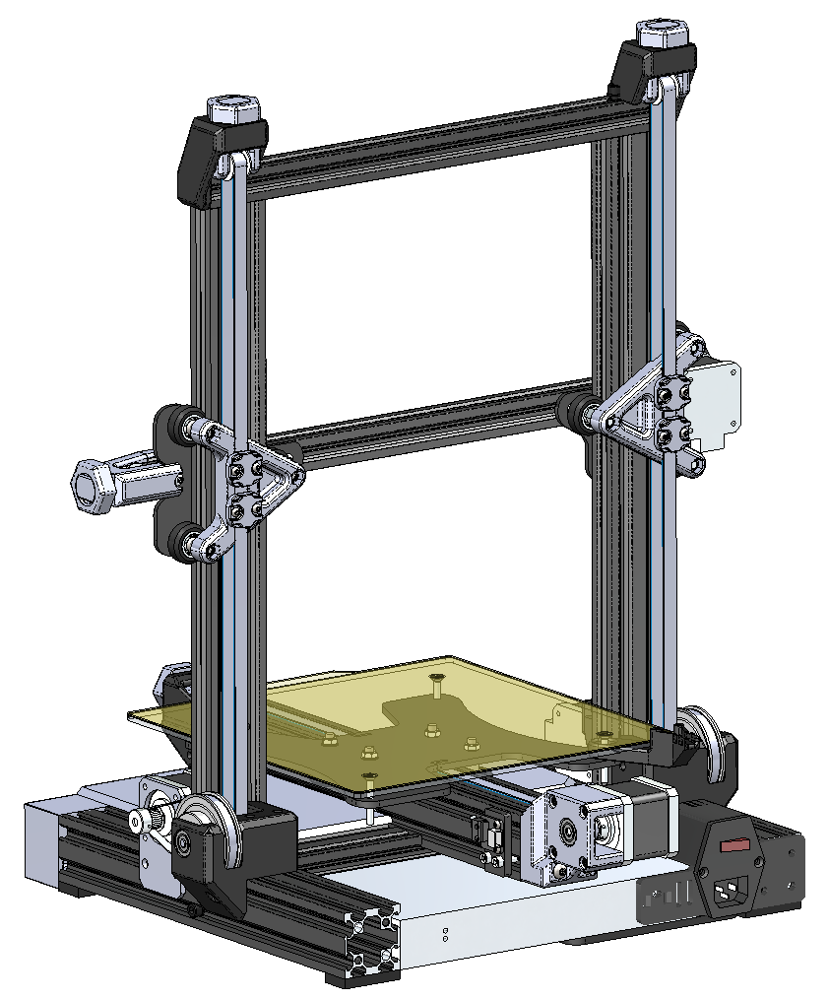

# Motion System Upgrades for the Ender 3

- Options
	- Belted Z with Rollers - Single or dual Z using 5:1 gearbox(es), 9mm belts, and custom tensioners.
		- [BOM](https://docs.google.com/spreadsheets/d/e/2PACX-1vSwatS81Ic4Gb2444vTR6-2apBhpKt-JdCN3oAfh10aeszloj0uu95zCPn2nBABrJI8vrNvn7x4FIQ1/pubhtml) - mostly right, but still a WIP
		- 
		- 
	- Belted Y with Rollers - 9mm belt and pulley using stock extruder stepper and improved motor mount. 
