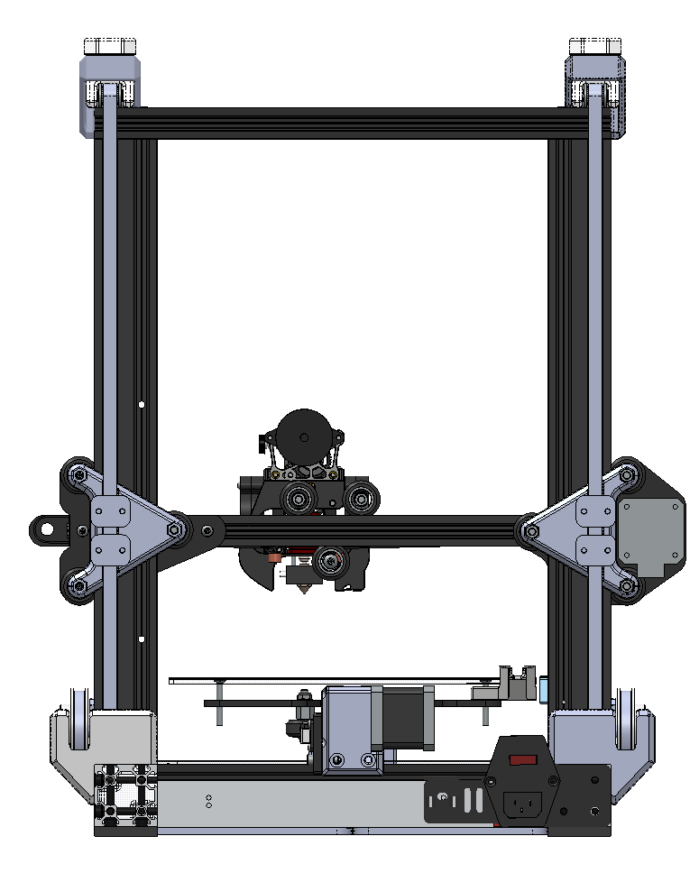
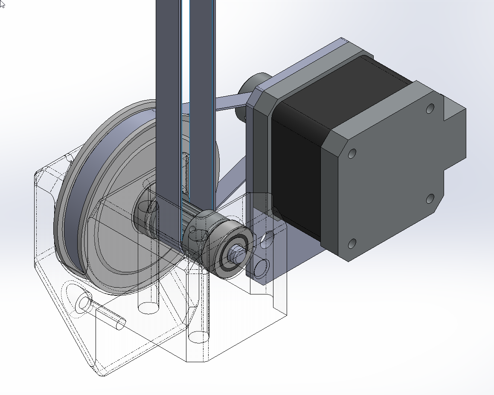

# Motion System Upgrades for the Ender 3

- Options
	- Belted Z with Rollers - Single or dual Z using 5:1 gearbox(es), 9mm belts, and custom tensioners.
		- 
		- 
	- Belted Y with Rollers - 9mm belt and pulley using stock extruder stepper and improved motor mount. 
