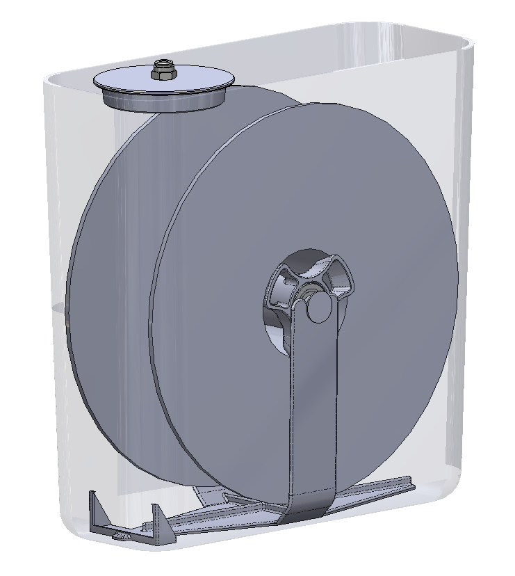
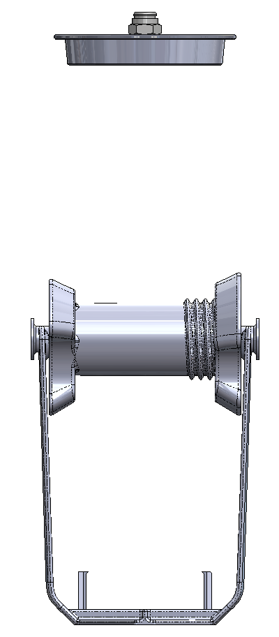

# Spool Drybox and feeder 

Remix of [Universal Filament Spool Holder by Butchja](https://www.thingiverse.com/thing:2070272) for <218mm OD, 48-58mm ID, <70mm wide spools meant to fit into a common cereal box.

**BOM**
- 2x 608 bearings
- 1/8 to 4mm Tube push to connect fitting x1
- [4mm OD, 2.5mm ID PTFE tube](https://www.amazon.com/dp/B09158X2TD)
- [Cereal Box](https://www.amazon.com/dp/B07NP98YKY) (look for the hexagon on the lid)
- [Hygrometer](https://www.amazon.com/dp/B08DJ24YMW)
- [4A Molecular Sieve](https://www.amazon.com/dp/B07RYRQN7Z)
